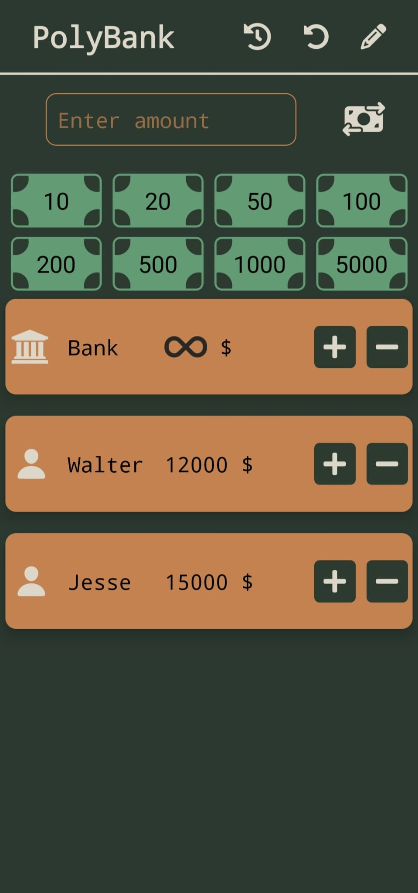
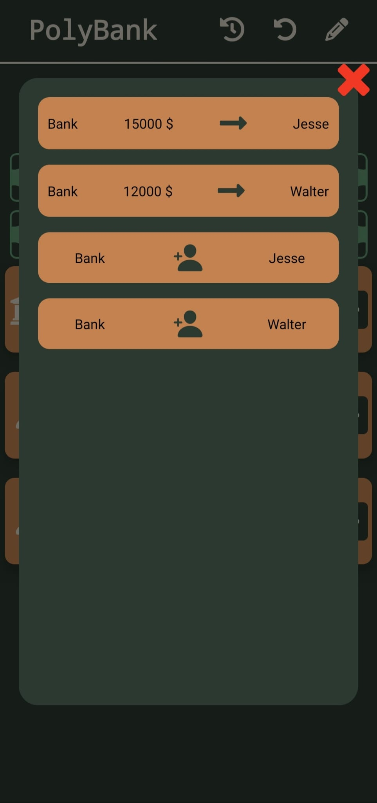
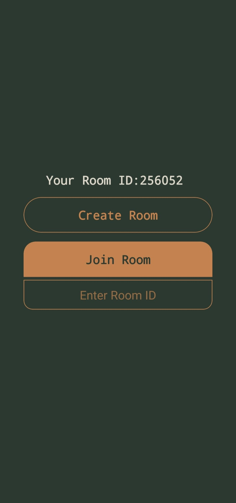

# Monopoly Banka Yönetimi Uygulaması 🎲🏦

> Monopoly oyununda para işlemlerini fiziksel banknotlar yerine dijital olarak yönetmenizi sağlayan React Native uygulaması.

---

## 📝 Proje Hakkında

Bu uygulama, gerçek Monopoly oyununda para ve banka işlemlerini kolaylaştırmak için tasarlanmıştır. Oyun sırasında fiziksel para ile uğraşmak yerine, tüm finansal hareketleri ve bakiyeleri bu uygulama üzerinden yönetebilirsiniz. Oyunu burada oynamazsınız, sadece para yönetimi için kullanılır.

---

## 🚀 Özellikler

- **Hazır Banknotlar:** Standart Monopoly para değerleri hazır olarak kullanılır.
- **Para Aktarımı:** Oyuncular arası hızlı para transferi.
- **Online Senkronizasyon:** Arkadaşlarınızın oyun odalarını gerçek zamanlı takip edin.
- **Geçmiş Takibi:** Yapılan tüm para hareketleri kayıt altına alınır ve görüntülenir.
- **Çoklu Dil Desteği:** Türkçe ve İngilizce dillerinde kullanım.
- **Oyuncu Yönetimi:** Kişi ekleme ve silme işlemleri kolayca yapılır.
- **Oyun Sıfırlama:** Tüm verileri sıfırlayarak yeni bir oyuna başlayabilirsiniz.

---

## 🎮 Kullanım Senaryosu

- Monopoly oyununda para işlemlerini dijital ortamda yönetmek isteyenler için ideal.
- Bankacı rolündeki oyuncular, tüm para hareketlerini kolayca takip eder.
- Online modda diğer oyuncuların bakiye ve hareketlerini anlık görebilirsiniz.

---

## ⚙️ Teknolojiler

- React Native
- Expo
- Firebase Firestore
- React Native Vector Icons

---

## 📸 Uygulama Görselleri

<!-- Görselleri buraya ekleyebilirsiniz -->

---

## 💻 Kurulum & Çalıştırma

1. Depoyu klonlayın

2. Gerekli bağımlılıkları yükleyin: npm install veya yarn install

3. Firebase yapılandırmanızı .env dosyasına ekleyin.

4. Uygulamayı başlatın: expo start
